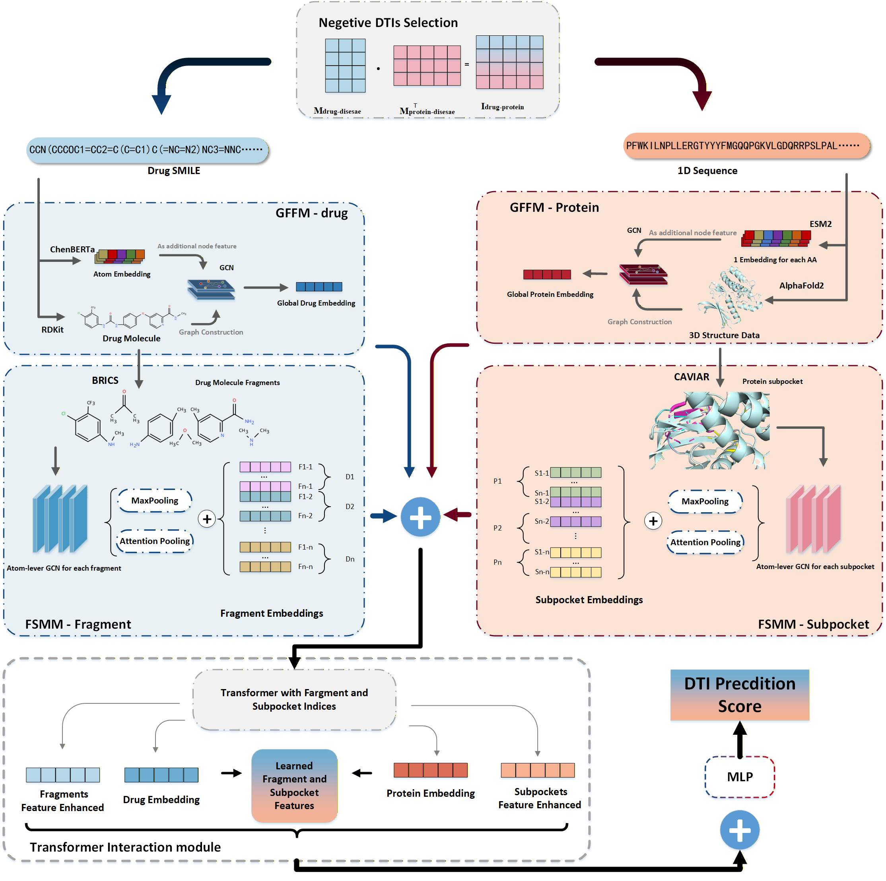

# FS-DTI：Predicting drug-target interactions by linking molecular fragments to protein subpockets

## Overview

<p align="center">
  
</p>

FS-DTI is a substructure information transformer model used for predicting drug-target interactions (DTI). It employs a Fragment-Subpocket Modeling Module (FSMM) to finely model the binding sites of proteins and drug molecules, and uses a Global Feature Fusion Module (GFFM) to integrate graph-level and sequence-level information. Benchmark evaluations show that FS-DTI outperforms state-of-the-art models.

## Installation

 
1. **Clone the Repository**

   ```bash
   git clone https://github.com/xiao456jia/FS-DTI.git
   cd FP-DTI
   ```

2. **Create a New Conda Environment**

   ```bash
    conda create --name fsdti python=3.8
    conda activate fsdti
   ```
2. **Install Dependencies**
   ```bash
   pip install -r requirements.txt
   ```

## Dataset Preparation

### Step 1: Download the Dataset

Download the original dataset from the [MolTrans repository](https://github.com/kexinhuang12345/MolTrans?tab=readme-ov-file) for the data splits of DAVIS and BIOSNAP.

### Step 2: Generate 3D Protein Structures
We use AlphaFold to convert protein sequences into 3D structures. You can download our precomputed AlphaFold results here: [BIOSNAP](https://drive.google.com/file/d/1bldeecpr5g9Q-qlTeHjdm5Z0MYG2j2Oa/view?usp=sharing)/[DAVIS](https://drive.google.com/file/d/198p6QG_WuSAl425y1OXtfR8TFunQbX6v/view?usp=sharing).

### Step 3: Identify Subpockets
Our method utilizes the CAVIAR algorithm to identify subpockets from the AlphaFold-generated structures. For sample scripts to run CAVIAR, please refer to our [Google Colab](https://colab.research.google.com/drive/1H2-uZiczJNkzgtFVR4Lq-oR99olTstlu?usp=sharing). Alternatively, you can download our processed dataset here: [Google Drive Link](https://drive.google.com/file/d/1hvQR5iB9QW_xEyBMhQp0cZtJlk2QEXN_/view?usp=sharing).

### Screen negative samples
If you want to filter negative samples yourself using the method in the paper, you can execute the following command:
```bash
python neg_sampler.py #Generate a negative sample matrix based on the data_3 dataset in Negactive folder
```
Then take the intersection with the negative samples in BIOSNAP/DAVIS.

Download the original data_3 dataset from the [DTI-MvSCA repository](https://github.com/plhhnu/DTI-MvSCA) in data_process/mat_data.

### Dataset Organization
We recommend structuring the dataset in the following format:

```plaintext
data/
│
├── DATASET_NAME/
│   ├── train.txt
│   ├── val.txt
│   ├── test.txt
│   ├── pdb/
│   ├── subpockets/
```
Replace DATASET_NAME with the name of the dataset you are working on (e.g., DAVIS, BIOSNAP) and ensure that the subfolders contain the respective files for each step.

## Run

If you have set the file path in run.py ，you can directly run the following command to start the experiments:

```bash
python run.py 
```
### Explanation of Parameters
You need to set the following parameters in the run.py file  
--task {davis/biosnap}: Specifies the dataset you are working on. Replace {davis/biosnap} with either davis or biosnap depending on your experiment.

--train_split <path_to_train_split>: Path to the training dataset split.

--val_split <path_to_val_split>: Path to the validation dataset split.

--test_split <path_to_test_split>: Path to the testing dataset split.

--pdb_dir <path_to_pdb_files>: Path to the directory containing the 3D protein structure files in PDB format. 

--subpocket_dir <path_to_subpockets>: Path to the directory containing identified subpockets. These should be generated using the CAVIAR algorithm or downloaded as per Step 3 of Dataset Preparation.

--metrics_dir <path_to_metrics_output>: Path to the directory where the evaluation metrics and results will be saved after the experiment runs.

For instance, if you are running an experiment with the DAVIS dataset and have all the required files prepared, the command might look like this:

```bash
python run.py 

#Parameter Settings
#task = "davis"
# train_split = "data/DAVIS/split_datasets_D/train_set.txt"
# val_split = "data/DAVIS/split_datasets_D/validation_set.txt"
# test_split = "data/DAVIS/split_datasets_D/test_set.txt"
#pdb_dir = "data/DAVIS/DAVIS_pdb/"
#subpocket_dir = "data/DAVIS/subpocket/"
#metrics_dir = "test_result/DAVIS/"
```

## Pretrained Language Models
Our method leverages pretrained language models, including ESM for protein representations and ChemBERTa for drug representations. We extend our gratitude to the authors of Graphein and Transformers for providing tools that simplify the integration of these models through user-friendly interfaces.

Our scripts automatically handle the generation of embeddings from the pretrained models. However, we recommend storing these embeddings as pickle files, especially for models like ESM, which are computationally intensive. This approach prevents repetitive runs and saves time during subsequent analyses.

To enable pickle storage, simply changing the parameter `pickle_dir = ...` in the relevant lines corresponding to the encoders in run.py. This will direct the generated embeddings to be saved in the specified directory for future use.

